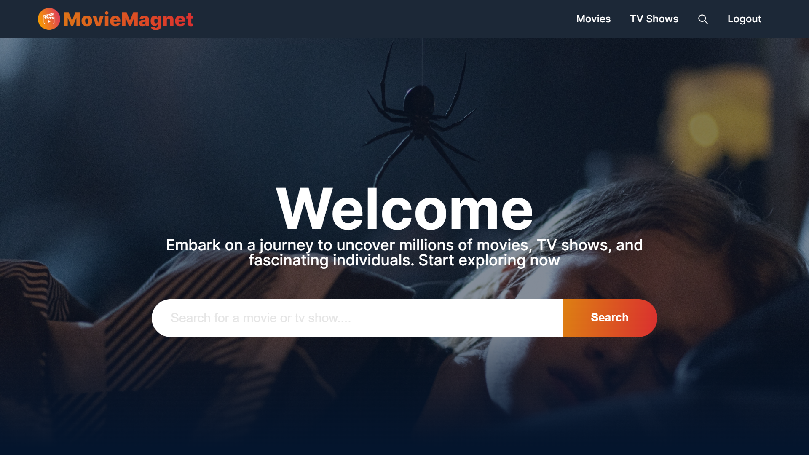
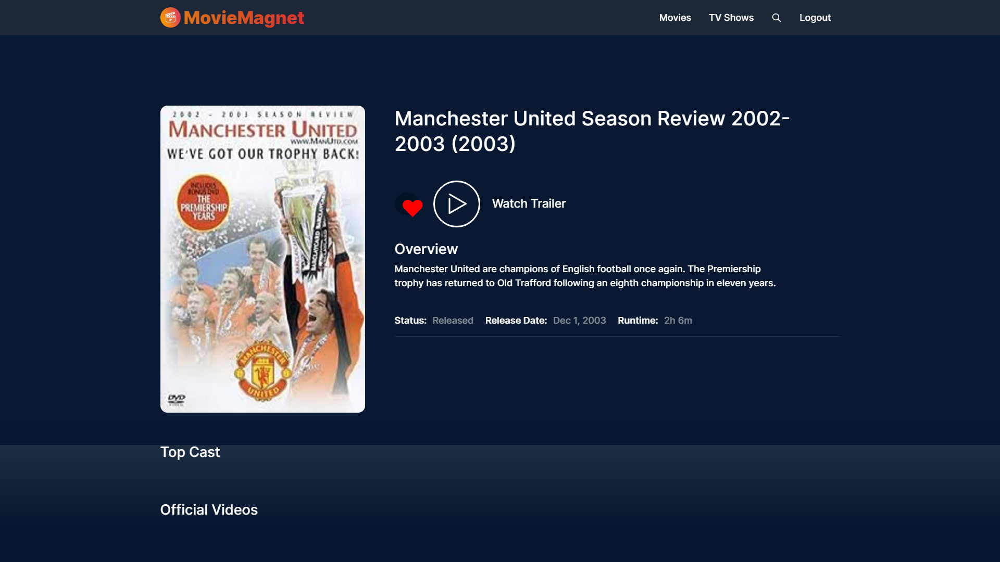
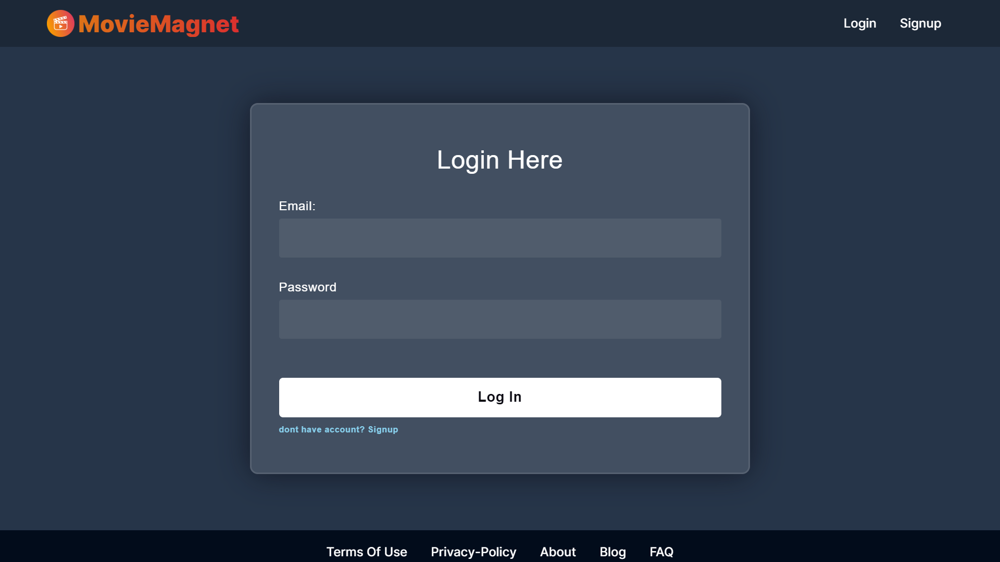
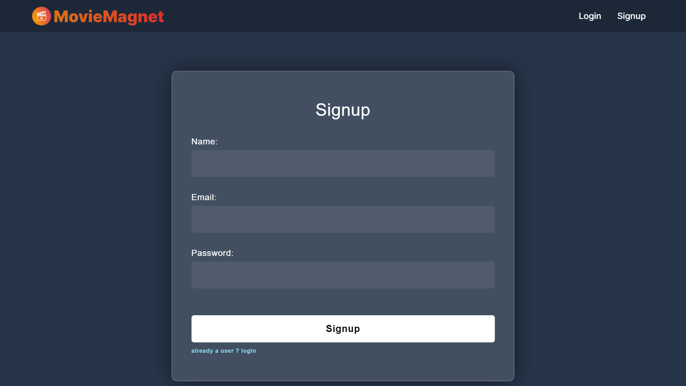
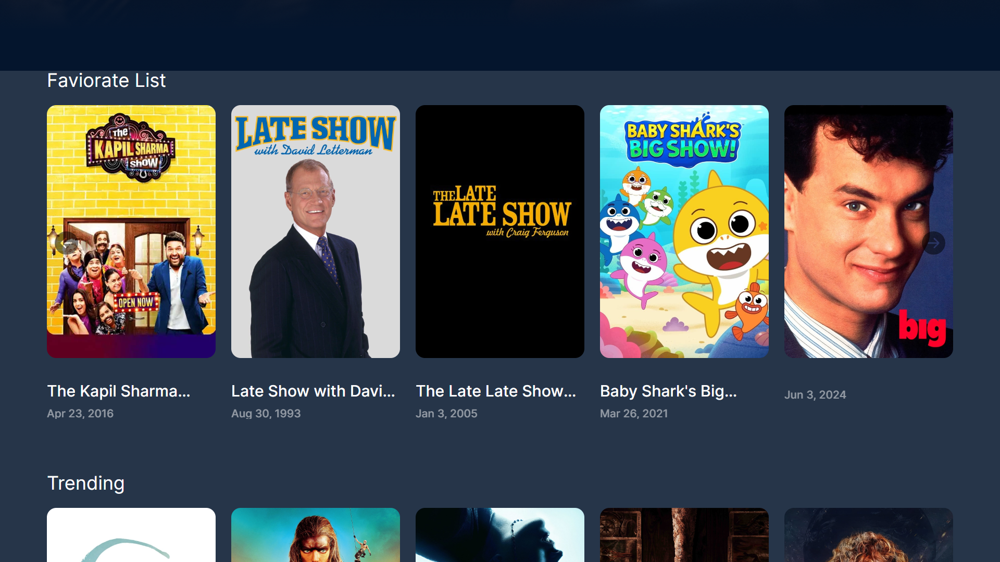

# Movie Recommendation App

This project is a full-stack application for movie recommendations. It allows users to browse, search, and explore movies, as well as maintain a list of their favorite movies. Users can sign up, log in, and manage their favorite movie list.

## Features

- User authentication (Sign up and Login)
- Browse movies on the home page
- Search for movies by title
- Explore movies by different media types
- View detailed information about a movie
- Add movies to a list of favorites
- Persist user session across page refreshes

## Screenshots

### Home Page


### Movie Details


### Login Page


### SignUp Page


### Favorite Movies



## Technology Stack

### Frontend
- React
- Redux for state management
- Axios for HTTP requests
- React Router for navigation
- SCSS for styling

### Backend
- Node.js
- Express.js
- MongoDB with Mongoose for database
- JWT for authentication
- bcrypt for password hashing

## Project Structure

project
│ README.md
│ package.json
│
└───client
│ │ package.json
│ │ src
│ │ public
│ └───...
│
└───server
│ package.json
│ index.js
└───models
└───routes
└───controllers
└───middlewares
└───...


## Prerequisites

- Node.js
- MongoDB
- npm (or yarn)

## Getting Started

### Setup Instructions

1. **Clone the repository:**
   ```bash
   git clone https://github.com/your-username/movie-recommendation-app.git
   cd movie-recommendation-app

2. **Install dependencies for both client and server**
# For backend
cd backend
npm install

# For frontend
cd frontend
npm install


3. **Starting the Application**
    (i) Start the backend server:

    cd backend
    npm run dev
    The backend server will start at http://localhost:5000.

    (ii) start the frontend
    cd frontend
    npm run dev
